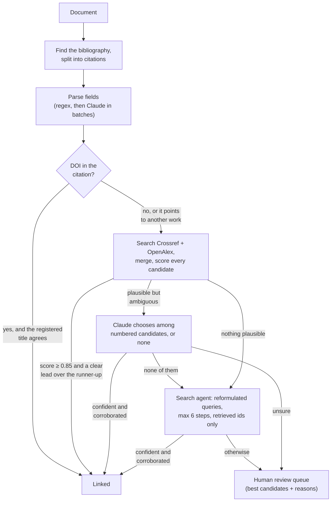

# reference-resolver-agent

An auditable AI agent that turns messy bibliographic references into **verified links to the
exact published work** (DOIs), and sends everything it is not sure about to a **human review
queue** instead of guessing.

> Independent project. It uses the public Crossref and OpenAlex APIs and the Anthropic API. The
> sample document describes a fictional organisation.

## The problem

Organisations that publish in several languages spend skilled time matching citations to the
exact work cited: the right **edition** of a report series, the right **language** version, the
right **DOI**. Citations arrive in every style, with truncated titles, wrong years and mistyped
DOIs.

- **String matching alone** breaks on that mess.
- **A language model alone** is worse: it will confidently invent a plausible DOI.

This project shows the pattern in between. Code handles what code can decide. The model steps
in only where the evidence is ambiguous, and only chooses among records that were actually
retrieved. Anything still uncertain goes to a person, with the evidence attached. Quality and
cost are measured on a gold set, and CI fails when quality drops.

## How it works



Every decision records its **method** (`doi_in_text`, `deterministic`, `llm_adjudication`,
`agent_search`) and a **trace** of each step, so any link can be audited afterwards.

### Guardrails

| Risk | Control |
|---|---|
| The model invents a DOI | It never writes identifiers. Adjudication returns a candidate *number* (a schema enum). The agent may only submit an identifier it retrieved: anything else is rejected and logged. |
| The model is confidently wrong | A model-assisted link also needs a minimum deterministic match score. Otherwise it goes to review. |
| A coin-flip between near-identical records | Automatic links need a clear lead over the runner-up (margin rule). |
| Runaway agent cost | A hard step budget per reference, and a model call only where the scores are ambiguous. Every run reports its token use and cost. |
| A mistyped DOI in the citation | The registered title is checked against the citation before the DOI is trusted. |
| Silent drift in evaluations | Recorded replays must match exactly. A missing recording fails the run instead of changing the result. |
| Load on public infrastructure | Caching, a minimum interval per host, bounded retries, and an optional contact email for the "polite pool". |

## Quick start

Requires Python 3.10+.

```bash
python -m venv .venv
# Windows (PowerShell): .venv\Scripts\Activate.ps1      macOS/Linux: source .venv/bin/activate
pip install -e ".[dev]"
pytest                                          # 52 offline tests, no API key needed

# Deterministic steps only: no key, no cost
refresolver run examples/aurora_working_paper.md --no-llm --out out/

# Full pipeline with Claude
export ANTHROPIC_API_KEY=sk-ant-...             # PowerShell: $env:ANTHROPIC_API_KEY="sk-ant-..."
export REFRESOLVER_CONTACT_EMAIL=you@example.org
refresolver run examples/aurora_working_paper.md --out out/
refresolver cite "Autor, D. (2016), Why are there still so many jobs?, JEP"
```

A run writes three files to the output folder:

- `report.md`: a summary table with links;
- `resolutions.json`: everything, including traces and candidate scores;
- `review_queue.csv`: one row per uncertain item, with the suggestion, the alternatives and an
  empty `decision` column for the reviewer.

### Use it from an AI assistant (MCP)

The resolver is also an MCP server with two read-only tools, `resolve_citation` and
`resolve_bibliography`. Claude Desktop configuration, Windows example:

```json
{
  "mcpServers": {
    "reference-resolver": {
      "command": "C:\\path\\to\\reference-resolver-agent\\.venv\\Scripts\\refresolver.exe",
      "args": ["serve"],
      "env": { "ANTHROPIC_API_KEY": "sk-ant-...", "REFRESOLVER_CONTACT_EMAIL": "you@example.org" }
    }
  }
}
```

## Evaluation

`evals/gold_references.jsonl` holds 22 citations with known answers. They cover edition traps,
a French edition, formatting noise, truncated titles, a year off by one, a mistyped DOI, a
DOI-only citation, and four items that must **not** be linked.

```bash
refresolver eval evals/gold_references.jsonl --cache-dir evals/recordings --out evals/results
```

This reports:

- precision of automatic links;
- recall;
- wrong links, and false links on items that have no DOI;
- review rate, and how often the right answer is among the review suggestions;
- model cost per reference.

The live run records every API and model response. After that, the same evaluation replays
offline, identically and for free, and CI runs it as a quality gate: it fails below 0.95
precision or on any false link. Details are in [evals/README.md](evals/README.md).

Run it with and without `--no-llm` to see what the model steps add, and at what cost.

### Results (live run, October 2026)

With Claude Sonnet 5 (`claude-sonnet-5`), search agent on. CI replays this run on every push.

| Metric | Value |
|---|---|
| References | 22 |
| Precision of automatic links | 1.00 |
| Recall (resolvable, linked correctly) | 0.72 |
| Wrong links | 0 |
| False links on unresolvable items | 0 |
| Sent to review | 3 (14%) |
| Review items with the answer among suggestions | 0 |
| Unresolved | 6 |
| Model cost | $0.2123 ($0.00965/ref) |

Deterministic steps only (`--no-llm`), same references:

| Metric | Value |
|---|---|
| References | 22 |
| Precision of automatic links | 1.00 |
| Recall (resolvable, linked correctly) | 0.22 |
| Wrong links | 0 |
| False links on unresolvable items | 0 |
| Sent to review | 2 (9%) |
| Review items with the answer among suggestions | 0 |
| Unresolved | 16 |
| Model cost | $0.0000 ($0.00000/ref) |

What this shows:

- **The model earns its place.** Without it, precision is perfect but only about a fifth of the
  resolvable references get linked; with it, about three quarters do, for about one US cent per
  reference.
- **The evaluation caught a real failure mode.** In the first live run precision was 0.93,
  below the 0.95 gate: the Frascati Manual was linked to a university-repository copy in
  OpenAlex, a record without a DOI, instead of the published version. The fix is a rule, not a
  prompt: a match without a DOI now goes to review. The tables above are after that fix.
- **What is still missed:** a citation whose year is off by one, a citation with a mistyped DOI,
  and a title whose subtitle the registry stores separately. They end up unresolved or in review,
  never wrongly linked; better query reformulation in the agent is the next step.

## Configuration

| Variable | Default | Purpose |
|---|---|---|
| `ANTHROPIC_API_KEY` | none | Enables the model steps. Without it, the deterministic pipeline still runs. |
| `REFRESOLVER_MODEL` | `claude-sonnet-5` | Any Claude model. A smaller model lowers cost; compare them on the gold set. |
| `REFRESOLVER_PRICE_INPUT` / `_OUTPUT` | `2.0` / `10.0` | USD per million tokens, for the cost report. |
| `REFRESOLVER_AUTO_ACCEPT` | `0.85` | Deterministic score for a link without the model |
| `REFRESOLVER_MIN_MARGIN` | `0.05` | Required lead over the runner-up |
| `REFRESOLVER_REVIEW_FLOOR` | `0.55` | Below this, a candidate is not worth a reviewer's time |
| `REFRESOLVER_LLM_ACCEPT` | `0.80` | Model confidence required for a model-assisted link |
| `REFRESOLVER_MAX_AGENT_STEPS` | `6` | Hard budget for the search agent, per reference |
| `REFRESOLVER_CONTACT_EMAIL` | none | Identifies you to Crossref and OpenAlex (polite pool) |
| `OPENALEX_API_KEY` | none | Optional OpenAlex key |
| `REFRESOLVER_CACHE_DIR` | `~/.cache/refresolver` | Recorded HTTP and model responses |
| `REFRESOLVER_OFFLINE` | `false` | Replay recordings only |

The thresholds are policy: they trade automation against precision. Change them, re-run the
evaluation, and compare.

## Limitations and roadmap

- [ ] **Translation linking**: given a work, find its official translation in the target
      language (what translators need most). Registry links between language editions are
      sparse, so this needs title translation plus search, measured on its own gold set.
- [ ] **Learning from reviewers**: feed decisions from `review_queue.csv` back into the gold set
      and use them to tune the thresholds.
- [ ] **More registries**: DataCite (datasets, arXiv), national library catalogues.
- [ ] **Throughput**: concurrent resolution with a shared rate limiter; prompt caching for
      extraction batches.
- [ ] **Native structured outputs** as an alternative to forced tool calls.

## Project layout

```
src/refresolver/
  resolver.py     the pipeline, prompts and guardrails
  scoring.py      deterministic match scoring (title, year, authors)
  sources.py      Crossref and OpenAlex clients, candidate merging
  llm.py          model interface, Anthropic adapter, record/replay, cost meter
  fetch.py        HTTP with cache, politeness, retries, offline replay
  text.py         bibliography detection, splitting, DOIs, normalisation
  evaluation.py   gold-set metrics
  report.py       report.md, resolutions.json, review_queue.csv
  mcp_server.py   MCP tools
  cli.py          run | cite | eval | serve
tests/            offline tests with fakes and fixtures, including the real SDK path
evals/            gold set and (after a live run) recordings and results
examples/         a fictional working paper with a mixed-style bibliography
docs/             design decisions
```

## License

MIT. See [LICENSE](LICENSE).
