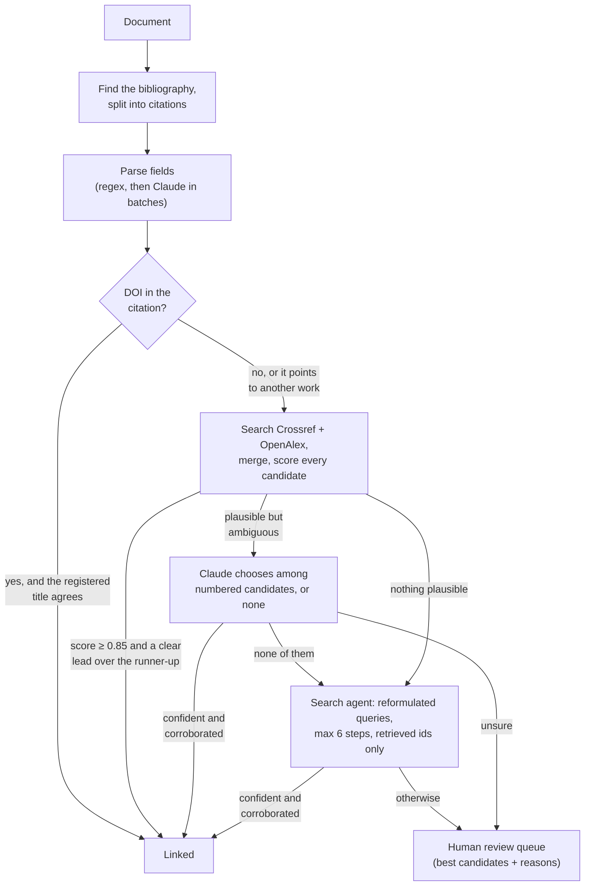

# reference-resolver-agent

[](https://github.com/flam7791/reference-resolver-agent/actions/workflows/ci.yml) [](LICENSE) 

An auditable AI agent that turns messy bibliographic references into **verified links to the
exact published work** (DOIs), and sends everything it is not sure about to a **human review
queue** instead of guessing.

> Independent project. It uses the public Crossref and OpenAlex APIs and the Anthropic API. The
> sample document describes a fictional organisation.

## The problem

Organisations that publish in several languages spend skilled time matching citations to the
exact work cited: the right **edition** of a report series, the right **language** version, the
right **DOI**. Citations arrive in every style, with truncated titles, wrong years and mistyped
DOIs.

- **String matching alone** breaks on that mess.
- **A language model alone** is worse: it will confidently invent a plausible DOI.

This project shows the pattern in between. Code handles what code can decide. The model steps
in only where the evidence is ambiguous, and only chooses among records that were actually
retrieved. Anything still uncertain goes to a person, with the evidence attached. Quality and
cost are measured on a gold set, and CI fails when quality drops.

## How it works



Every decision records its **method** (`doi_in_text`, `deterministic`, `llm_adjudication`,
`agent_search`) and a **trace** of each step, so any link can be audited afterwards.

### Guardrails

| Risk | Control |
|---|---|
| The model invents a DOI | It never writes identifiers. Adjudication returns a candidate *number* (a schema enum). The agent may only submit an identifier it retrieved: anything else is rejected and logged. |
| The model is confidently wrong | A model-assisted link also needs a minimum deterministic match score. Otherwise it goes to review. |
| A coin-flip between near-identical records | Automatic links need a clear lead over the runner-up (margin rule). |
| Runaway agent cost | A hard step budget per reference, and a model call only where the scores are ambiguous. Every run reports its token use and cost. |
| A mistyped DOI in the citation | The registered title is checked against the citation before the DOI is trusted. |
| Silent drift in evaluations | Recorded replays must match exactly. A missing recording fails the run instead of changing the result. |
| Load on public infrastructure | Caching, a minimum interval per host, bounded retries, and an optional contact email for the "polite pool". |

## Quick start

Requires Python 3.10+.

```bash
python -m venv .venv
# Windows (PowerShell): .venv\Scripts\Activate.ps1      macOS/Linux: source .venv/bin/activate
pip install -e ".[dev]"
pytest                                          # 70 offline tests, no API key needed

# Deterministic steps only: no key, no cost
refresolver run examples/aurora_working_paper.md --no-llm --out out/

# Full pipeline with Claude
export ANTHROPIC_API_KEY=sk-ant-...             # PowerShell: $env:ANTHROPIC_API_KEY="sk-ant-..."
export REFRESOLVER_CONTACT_EMAIL=you@example.org
refresolver run examples/aurora_working_paper.md --out out/
refresolver cite "Autor, D. (2016), Why are there still so many jobs?, JEP"
```

### With a local open-weight model (no key, nothing leaves the machine)

The model steps also run on any OpenAI-compatible endpoint: a local model through
[Ollama](https://ollama.com), vLLM or llama.cpp, or an LLM gateway such as
[governed-llm-gateway](https://github.com/flam7791/governed-llm-gateway).

```bash
ollama pull qwen2.5:7b                           # or llama3.1:8b; any model with tool calling
export REFRESOLVER_PROVIDER=openai_compatible    # PowerShell: $env:REFRESOLVER_PROVIDER="openai_compatible"
export REFRESOLVER_MODEL=qwen2.5:7b
export REFRESOLVER_PRICE_INPUT=0 REFRESOLVER_PRICE_OUTPUT=0
refresolver run examples/aurora_working_paper.md --out out-local/
refresolver eval evals/gold_references.jsonl --cache-dir evals/recordings-local --out evals/results-local
```

Small local models do not always honour a forced tool call. The adapter then accepts a JSON
object from the text reply, and anything else counts as "no decision", which sends the
reference to the review queue rather than linking it: a weaker model lowers automation, not
precision. Compare the three result folders to see the trade-off.

A run writes three files to the output folder:

- `report.md`: a summary table with links;
- `resolutions.json`: everything, including traces and candidate scores;
- `review_queue.csv`: one row per uncertain item, with the suggestion, the alternatives and an
  empty `decision` column for the reviewer.

### Use it from an AI assistant (MCP)

The resolver is also an MCP server with two read-only tools, `resolve_citation` and
`resolve_bibliography`. Claude Desktop configuration, Windows example:

```json
{
  "mcpServers": {
    "reference-resolver": {
      "command": "C:\\path\\to\\reference-resolver-agent\\.venv\\Scripts\\refresolver.exe",
      "args": ["serve"],
      "env": { "ANTHROPIC_API_KEY": "sk-ant-...", "REFRESOLVER_CONTACT_EMAIL": "you@example.org" }
    }
  }
}
```

A skill tells the assistant how to use the tools well: pass citations as written, report
`linked`, `review` and `unresolved` honestly, and never fill a gap with a DOI from memory. Copy
[`skills/reference-resolver`](skills/reference-resolver/SKILL.md) into your assistant's skills
folder (for Claude Code, `~/.claude/skills/`).


## Evaluation

`evals/gold_references.jsonl` holds 22 citations with known answers. They cover edition traps,
a French edition, formatting noise, truncated titles, a year off by one, a mistyped DOI, a
DOI-only citation, and four items that must **not** be linked.

```bash
refresolver eval evals/gold_references.jsonl --cache-dir evals/recordings --out evals/results
```

This reports:

- precision of automatic links;
- recall;
- wrong links, and false links on items that have no DOI;
- review rate, and how often the right answer is among the review suggestions;
- model cost per reference.

The live run records every API and model response. After that, the same evaluation replays
offline, identically and for free, and CI runs it as a quality gate: it fails below 0.95
precision or on any false link. Details are in [evals/README.md](evals/README.md).

Run it with and without `--no-llm` to see what the model steps add, and at what cost.

### Calibration: are the thresholds where the evidence says?

Every evaluation also reports two calibration tables (`refresolver calibrate` computes them
from any saved run): the accuracy of the top candidate per band of deterministic score, and the
accuracy of the model's choices per band of its stated confidence. From the four recorded runs
on the 22 references:

| | Score ≥ 0.95 | 0.85–0.95 | below 0.85 |
|---|---|---|---|
| Top candidate correct, fields parsed by Claude | 13/13 | 4/4 | 0/4 |
| Top candidate correct, heuristic parsing (no model, Llama, Qwen) | 13/13 | 3/4 | 0/4 |

| Model choices | Confidence ≥ 0.90 | 0.80–0.90 | below 0.80 |
|---|---|---|---|
| Claude Sonnet 5 | 5/5 correct | none | none |
| Llama 3.1 8B | 3/3 correct | none | none |
| Qwen 2.5 7B | 3/4 correct | 0/1 correct | none |

- **The auto-link threshold sits at the edge of the evidence.** Below a score of 0.85 the top
  candidate was never the cited work; at 0.85–0.95 with heuristic parsing it was wrong once, and
  the margin rule (a clear lead over the runner-up) is what kept that case from being linked.
- **A model's stated confidence is not evidence on its own.** Qwen's two wrong choices came with
  confidence 0.95 and 0.80, both on citations with no DOI to find; the corroboration rules (score
  floor, a cited author on the candidate) sent both to review. That is why a model-assisted link
  needs code to agree.
- **Five choices per model is not a calibration curve.** The tables show where data is missing
  ("no data") rather than hiding it; reviewers' decisions from `review_queue.csv` are the way to
  grow them (see the roadmap).

### Results (live run, October 2026)

With Claude Sonnet 5 (`claude-sonnet-5`), search agent on. CI replays this run on every push
and fails below 0.95 precision, on any false link, or if any database search failed.

| Metric | Value |
|---|---|
| References | 22 |
| Precision of automatic links | 1.00 |
| Recall (resolvable, linked correctly) | 1.00 |
| Wrong links | 0 |
| False links on unresolvable items | 0 |
| Sent to review | 2 (9%) |
| Review items with the answer among suggestions | 0 |
| Unresolved | 2 |
| Source errors (searches that failed) | 0 |
| Model cost | $0.0851 ($0.00387/ref) |

Deterministic steps only (`--no-llm`), same references:

| Metric | Value |
|---|---|
| References | 22 |
| Precision of automatic links | 1.00 |
| Recall (resolvable, linked correctly) | 0.83 |
| Wrong links | 0 |
| False links on unresolvable items | 0 |
| Sent to review | 4 (18%) |
| Review items with the answer among suggestions | 3 |
| Unresolved | 3 |
| Source errors (searches that failed) | 0 |
| Model cost | $0.0000 ($0.00000/ref) |

What the live runs taught, in order:

- **The first run measured an outage, not the resolver.** Crossref rejected every search
  (the request asked for a field Crossref does not accept), and OpenAlex rejected titles
  containing "?". The resolver carried on with what was left, so the numbers looked plausible.
  The evaluation now counts source errors, and a run with any of them fails the gate.
- **A match without a DOI goes to review, not to a link.** A university-repository copy of an
  OECD manual had been linked instead of the published version.
- **Two scoring bugs, found by the second run.** Names cited as "Wilkinson, M. D." were read with
  an initial as the surname, so the right paper lost its author evidence; and a short title
  found inside a long citation counted as a full match, so a short comment in another journal
  outscored the cited paper. Both are fixed and covered by tests.
- **Compare the two tables** to see what the model adds: it reads messy citations (capitals,
  missing quotes, odd orders) into fields the scoring can use, and adjudicates the close calls.

### With local open-weight models (live runs, October 2026)

Llama 3.1 8B and Qwen 2.5 7B through Ollama (8k context, temperature 0) on a laptop CPU (Intel
Core i7-13620H, 16 GB, integrated graphics), same 22 references. Results in
`evals/results-llama3.1-8b-ctx8k` and `evals/results-qwen2.5-7b-ctx8k`.

| Metric | Claude Sonnet 5 | Llama 3.1 8B, local | Qwen 2.5 7B, local | No model |
|---|---|---|---|---|
| Precision of automatic links | 1.00 | **1.00** | **1.00** (0.95 before the rule below) | 1.00 |
| Recall (resolvable, linked correctly) | 1.00 | **1.00** | **1.00** | 0.83 |
| Wrong or false links | 0 | **0** | **0** (1 before the rule) | 0 |
| Sent to review | 2 (9%) | 1 (5%) | 2 (9%) | 4 (18%) |
| Unresolved | 2 | 3 | 2 | 3 |
| Model cost | $0.0851 | $0.00 | $0.00 | $0.00 |
| Run time | not recorded | about 16 minutes (laptop CPU) | about 16 minutes (laptop CPU) | not recorded |

- **Qwen made the first false link of any run, and the design changed because of it.** For a web
  page with no DOI (`OECD.AI Policy Observatory, Live data on AI`), the registries returned three
  unrelated works sharing words of the title, tied on score, none by a cited author. Qwen picked
  one, a Zenodo record on benchmarking platforms, with confidence 0.95. A model may now choose
  among candidates but not against the evidence: when none of a candidate's authors appears in
  the citation, the case goes to a person (`model_link`, tested with this case). Replayed from
  the recorded answers, the same run gives precision 1.00 and no false link; Claude's and
  Llama's results are unchanged, since none of their model links had that profile.
- **A failed call is now recorded too.** Qwen's first extraction batch timed out and the run
  fell back to heuristic parsing, as designed, but the failure was not in the recording, so the
  run could not be replayed. Failures are now recorded and replayed as failures.
- **The first Llama run scored 0.89 recall, and the cause was the adapter.** Llama returned tool
  arguments in the wrong JSON types (the list of references as a string, "1" for 1, "null" for
  null), so every extraction and most adjudications were discarded. Even then it made **no wrong
  link**: a weaker model lowered automation, not precision, as designed. Arguments are now
  repaired against the tool's schema (`coerce_to_schema`, tested with the recorded shapes), and
  the re-run matched Claude on precision and recall.
- **Where a local model adds value is adjudication and search.** Llama decided three close calls
  among retrieved candidates; Qwen decided one and found two through the search agent. Batch
  extraction still mostly falls back to heuristic parsing (2 of 22 references parsed by either
  model), which this gold set tolerates; harder citation styles would not.
  `REFRESOLVER_EXTRACT_BATCH=1` (0.4) extracts one reference per call for small models; it is
  not measured yet:

  ```bash
  export REFRESOLVER_PROVIDER=openai_compatible REFRESOLVER_MODEL=qwen2.5:7b-ctx8k
  export REFRESOLVER_PRICE_INPUT=0 REFRESOLVER_PRICE_OUTPUT=0 REFRESOLVER_EXTRACT_BATCH=1
  refresolver eval evals/gold_references.jsonl --cache-dir evals/recordings-qwen-batch1 \
    --out evals/results-qwen2.5-7b-ctx8k-batch1
  ```

  Compare "parsed by the model" in its `eval_resolutions.json` (`parsed by llm` in each trace)
  and recall with the batched Qwen run above.
- **Twenty-two references is a small set**, and these are one run's numbers per model on one
  laptop.

## Configuration

| Variable | Default | Purpose |
|---|---|---|
| `ANTHROPIC_API_KEY` | none | Enables the model steps. Without it, the deterministic pipeline still runs. |
| `REFRESOLVER_PROVIDER` | `anthropic` | or `openai_compatible` (Ollama, vLLM, llama.cpp, an LLM gateway) |
| `REFRESOLVER_MODEL` | `claude-sonnet-5` | The model or deployment name. Compare models on the gold set. |
| `REFRESOLVER_BASE_URL` | `http://localhost:11434/v1` | OpenAI-compatible endpoint (Ollama by default) |
| `REFRESOLVER_API_KEY` | none | Only if the endpoint needs one (a gateway or cloud); a local model does not |
| `REFRESOLVER_PRICE_INPUT` / `_OUTPUT` | `2.0` / `10.0` | USD per million tokens, for the cost report. |
| `REFRESOLVER_AUTO_ACCEPT` | `0.85` | Deterministic score for a link without the model |
| `REFRESOLVER_MIN_MARGIN` | `0.05` | Required lead over the runner-up |
| `REFRESOLVER_REVIEW_FLOOR` | `0.55` | Below this, a candidate is not worth a reviewer's time |
| `REFRESOLVER_LLM_ACCEPT` | `0.80` | Model confidence required for a model-assisted link |
| `REFRESOLVER_MAX_AGENT_STEPS` | `6` | Hard budget for the search agent, per reference |
| `REFRESOLVER_EXTRACT_BATCH` | `20` | References per extraction call; try `1` for small local models |
| `REFRESOLVER_CONTACT_EMAIL` | none | Identifies you to Crossref and OpenAlex (polite pool) |
| `OPENALEX_API_KEY` | none | Optional OpenAlex key |
| `REFRESOLVER_CACHE_DIR` | `~/.cache/refresolver` | Recorded HTTP and model responses |
| `REFRESOLVER_OFFLINE` | `false` | Replay recordings only |

The thresholds are policy: they trade automation against precision. Change them, re-run the
evaluation, and compare.

## Limitations and roadmap

- [ ] **Translation linking**: given a work, find its official translation in the target
      language (what translators need most). Registry links between language editions are
      sparse, so this needs title translation plus search, measured on its own gold set.
- [ ] **Learning from reviewers**: feed decisions from `review_queue.csv` back into the gold set
      and use them to tune the thresholds, with the calibration tables as the evidence.
- [ ] **More registries**: DataCite (datasets, arXiv), national library catalogues.
- [ ] **Throughput**: concurrent resolution with a shared rate limiter; prompt caching for
      extraction batches.
- [ ] **Native structured outputs** as an alternative to forced tool calls.

## Project layout

```
src/refresolver/
  resolver.py     the pipeline, prompts and guardrails
  scoring.py      deterministic match scoring (title, year, authors)
  sources.py      Crossref and OpenAlex clients, candidate merging
  llm.py          model interface, Anthropic adapter, record/replay, cost meter
  fetch.py        HTTP with cache, politeness, retries, offline replay
  text.py         bibliography detection, splitting, DOIs, normalisation
  evaluation.py   gold-set metrics and calibration tables
  report.py       report.md, resolutions.json, review_queue.csv
  mcp_server.py   MCP tools
  cli.py          run | cite | eval | calibrate | serve
skills/           a SKILL.md for assistants that call the MCP tools
tests/            offline tests with fakes and fixtures, including the real SDK path
evals/            gold set and (after a live run) recordings and results
examples/         a fictional working paper with a mixed-style bibliography
docs/             design decisions
AGENTS.md         commands and invariants for coding agents (CLAUDE.md imports it)
```

## License

MIT. See [LICENSE](LICENSE).
